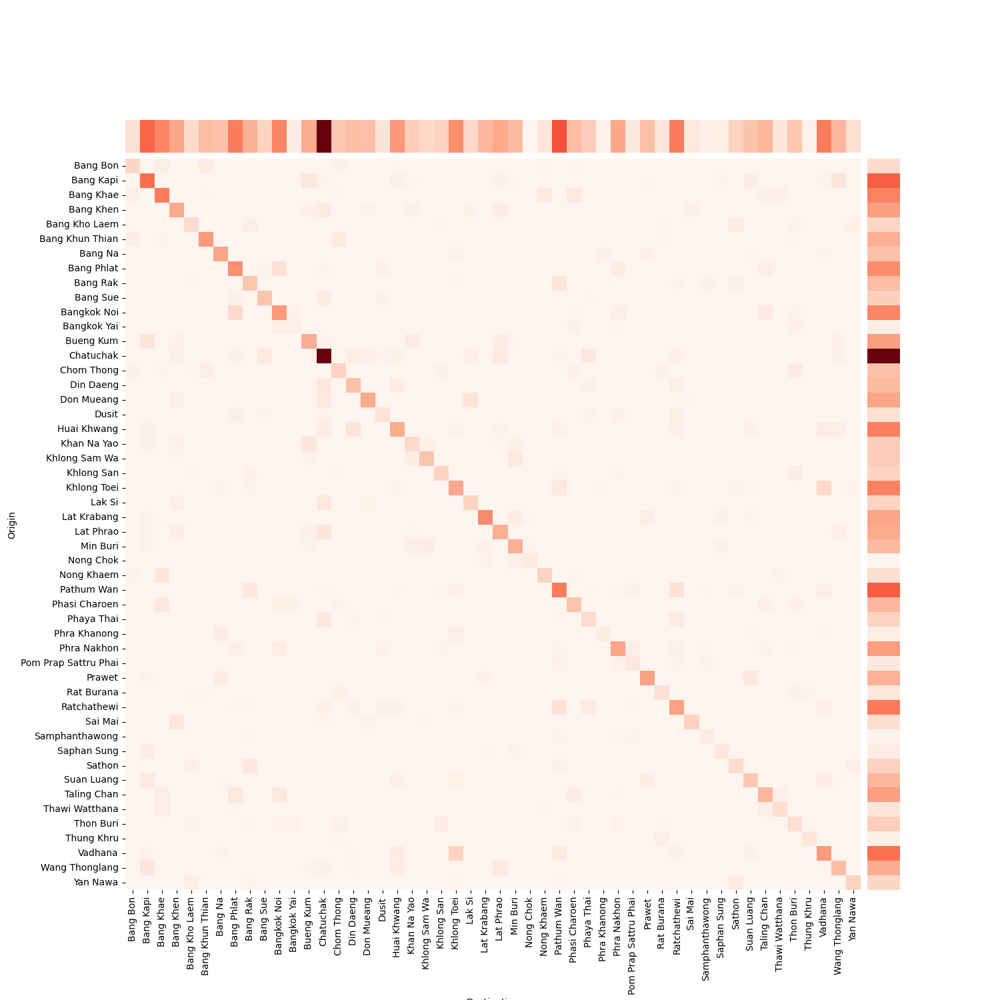

# Trip-Analysis-toolkits

### Table of contents
- [Prerequisites](#prerequisites)
- [Installation](#installation)
- [Running Program](#running-program)
- [Indicator Results](#indicator-results)

### Prerequisites
This tookits was developed on HDP 3.1.4 
- Hadoop cluster with Hive installed (Hortonwork Data Platform (HDP) 3.1.4)
- Hive 3.1.0
- Spark 2.3.2
- Python 2.7.5
- Jupyter Hub

### Installation
- Setup the environment according to the requirement software section
- Clone the repository
    ```
    git clone https://github.com/SpatialDataCommons/Trip-Analysis-toolkits-.git
    ```
- install Python requirement packages in ```requirement.txt``` using command
    ```
    pip install -r requirements.txt
    ```

### Running Program
1. Create a Hive database for use in the creation of tables in the next process steps.
2. Initialize tables by running through ```1_initialize_project.ipynb``` notebook.

    ***Requirement parameters***
    ```
    database_name       : database name
    probe_table         : table name for raw probe taxi data
    trip_table          : table name for generated trip data
    od_table            : table name for Origin-Destination results
    speed_acc_table     : table name for Speed and accerelation results
    spark_stat_table    : table name for Spark performance statistics
    ```

3. Insert probe taxi data into a table using ```2_insert_probe_data.ipynb``` notebook.

    ***Requirement parameters***
    ```
    database_name       : database name
    probe_table         : table name for raw probe taxi data
    month               : month to be utilized ex. '202301'
    folder_path         : location path to save downloaded probe taxi files 
    ```
    - using ```get_data()``` function to download the raw probe data file from the url ```https://itic.longdo.com/opendata/probe-data/PROBE-{month}.tar.bz2```
    - using ```extract_file()``` function to extract the probe taxi compressed file into a folder.
    - using ```insert_data()``` function to insert the probe taxi data from ```csv``` file into the probe table.

   In case the data is not downloaded from the function ```get_data()``` and ```extract_file()```, the table format of ```csv``` file should be as follows:

| Feature | Description | Example |  
| :---: | --- | --- |
| Vehicle ID | Unique vehicle ID | 7LO1lqJvO7t0Scmfc... |
| GPS Valid | 1 = enough satellite for GPS fix | 1 |
| lat | GPS latitude up to 5 decimal places | 14.51006 |
| lon | GPS longitude up to 5 decimal places | 101.3771 |
| timestamp | GPS timestamp ( GMT+7 ) | 2023-01-28 12:38:14
| speed | km/h | 0 |
| heading | vehicle heading direction [0-360) degree from North=0 | 86 |
| for_hire_light | "For Hire" light is ON 1 = light on  => possibly no passenger 0 = light off => possibly carrying passengers | 0 |
| engine_acc | car key status active, can be: 1 (active, the data will be collected every minutes) or 0 (inactive, data collected every 3 minutes) | 1 |

5. Generate the trip information using ```3_create_trip.ipynb```

    ***Requirement parameters***
    ```
    database_name       : database name
    probe_table         : table name for raw probe taxi data
    trip_table          : trip table name for recording the results
    spark_stat_table    : spark statistics table for storing the performance of each execution
    shape_path          : location path of the shapefile that represents the administrative boundary

    start_date          : start date to be process
    end_date            : end date to be process
    distance_threshold  : distance threshold (in kilometers) to be used in distinguishing stopping periods ex. 0.15
    duration_threshold  : duration threshold (in minutes) to be used in distinguishing stopping periods ex. 8
    ```
    - using ```generate_trip()``` function to generate the trip information into the ```trip_table```.

6. Generate the Origin-Destination information using ```4_origin_destination.ipynb```

    ***Requirement parameters***
    ```
    database_name       : database name
    trip_table          : trip table name that had been generated in previous step
    od_table            : origin-destination table name for recording the results 
    shape_path          : location path of the shapefile that represents the administrative boundary
    month               : specific month to be process ex. '202301'
    ```
    - using ```generate_od()``` function to generate the Origin-Destination information into the ```od_table```.

7. Generate the Speed and Acceleration information using ```5_speed_acc.ipynb```

    ***Requirement parameters***
    ```
    database_name       : database name
    trip_table          : trip table name that had been generated in previous step
    speed_acc_table     : table name to storing the speed and accerelation information results
    start_date          : start date to be process
    end_date            : end date to be process
    ```
    - using ```generate_speed_acc()``` function to generate the speed and accerelation information into the ```speed_acc_table```.

8. After finished the analysis processing steps, the results can be visualized by using ```6_visualize_stat.ipynb```. The visualizations consist of travel patterns, accessibility, speed & safety, and stopping hot spot

### Indicator Results
1. Travel pattern
  - **Total trips** reflect daily mobility demands.
    
    
  - **Trip length** shows how far a taxi is usually used to search for a customer.

    
  - **Travel time** shows the duration a passenger spends in a taxi.
    
    
  - **Origin Destination** represents the heatmap of density from Origin(pickup) to Destination(drop off) regions in the specific province.
    
    
2. Accessibility
  - **Service available map** displays the high density of pickup and drop-off zones on the map.
    
    
3. Speed and Safety
  - **Distribution of speed on vacant and busy trips** shows distribution of speed using in both busy and vacant period.
    
    
  - **Speeding area** displays a scatter plot of speed range in the specific area on the map.
    
    
4. Stopping period characteristics
  - **Stoppinp hourly volume** shows the amount of taxis each time period.
    
    
  - **Stopping hot spot** displays the high density of stopping zones of each cluster period.
    
    
